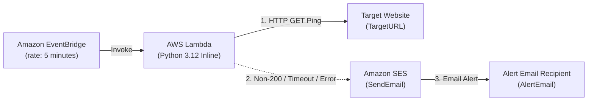

# Website Uptime & Ping Alert System

An automated, serverless AWS solution that monitors a target website's availability by issuing HTTP requests on a scheduled interval (every 5 minutes) via Amazon EventBridge and AWS Lambda. If the target website returns a non-200 HTTP status code or fails to respond due to network errors or timeouts, an email alert is automatically triggered via Amazon Simple Email Service (SES).

---

## ⚠️ CRITICAL WARNING: Amazon SES Email Verification Requirement

> [!WARNING]
> **Manual Email Verification Required in Amazon SES Console**:
> Before the Lambda function can successfully send downtime alert emails, the email address provided for `AlertEmail` **MUST be manually verified in the Amazon SES console** in your deployment region.
>
> If your AWS account is in the **Amazon SES Sandbox** (the default for new accounts), SES will fail to deliver messages unless both the sender (`Source`) and receiver (`ToAddresses`) email addresses are verified identities.
>
> **Verification Steps**:
> 1. Open the [Amazon SES Console](https://console.aws.amazon.com/ses/).
> 2. Go to **Identities** -> **Create identity**.
> 3. Choose **Email address**, enter your `AlertEmail`, and click **Create identity**.
> 4. Check your email inbox and click the verification link sent by AWS SES.

---

## System Architecture



---

## Features

- **Built-in Python 3.12 Runtime**: Uses standard Python libraries (`urllib.request`) and `boto3`. No external packages or layers required.
- **Scheduled Monitoring**: Automated execution every 5 minutes via Amazon EventBridge.
- **Least Privilege IAM**: Scoped execution role with `AWSLambdaBasicExecutionRole` and explicit `ses:SendEmail` permissions.
- **Single-File CloudFormation Template**: Easy to deploy with zero build steps.

---

## CloudFormation Parameters

| Parameter | Type | Description | Default / Example |
| :--- | :--- | :--- | :--- |
| `TargetURL` | `String` | The URL of the website to monitor. | `https://example.com` |
| `AlertEmail` | `String` | Email address to send alerts from/to. | `admin@example.com` |

---

## Deployment Instructions

### Prerequisites
- [AWS CLI](https://aws.amazon.com/cli/) installed and configured with appropriate permissions.
- Verified email identity in Amazon SES (see warning above).

### 1. Deploy Stack via AWS CLI

Run the following command in your terminal from this folder:

```bash
aws cloudformation deploy \
  --template-file template.yaml \
  --stack-name website-uptime-ping-alert \
  --parameter-overrides TargetURL="https://mywebsite.com" AlertEmail="admin@example.com" \
  --capabilities CAPABILITY_IAM \
  --region us-east-1
```

### 2. Verify Deployment

- Check your AWS CloudFormation Console to ensure the stack reaches `CREATE_COMPLETE`.
- Test the Lambda function manually in the AWS Console to verify HTTP ping execution and log outputs.
- To test downtime alerts, set `TargetURL` to an invalid or non-existent endpoint (e.g., `https://httpbin.org/status/500`).

### 3. Cleanup / Teardown

To delete the provisioned infrastructure:

```bash
aws cloudformation delete-stack --stack-name website-uptime-ping-alert --region us-east-1
```
